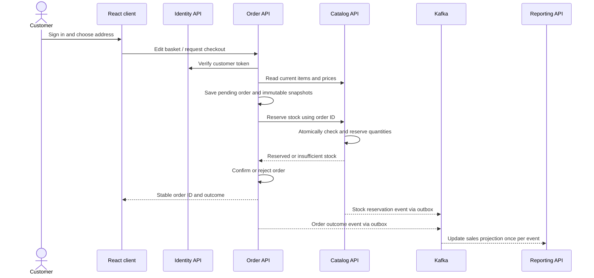

# Sprint 02 implementation plan — Addresses, basket, checkout, orders and sales reporting

> **Alignment notice — 22 September 2026:** The revised project design places the sales report in Order, uses a gateway for browser traffic, and postpones Reporting's first deployment to Sprint 4. This earlier plan remains historical planning material. Use [Sprint-01-02-Alignment-Plan.md](Sprint-01-02-Alignment-Plan.md) for the current remediation scope and evidence gates.

**Project:** Marketflow — Supermarket Management and Courier Delivery Platform  
**Status:** Proposed execution plan, based on the supplied `Marketflow README.md` and the code currently in this workspace. It does not claim completed implementation, a Jira project, a GitHub repository, Azure resources, test results or stakeholder acceptance.  
**Original proposed window:** 31 August–14 September 2026; proposed review: 14 September 2026. These dates have passed as of 21 September 2026. Agree actual dates at planning and record the real sequence of work and ceremonies.  
**Planning length:** Ten working days, adjusted to team availability.  
**Sprint goal:** A signed-in customer can save an address, edit a basket and place one stock-safe order. The customer can view its status; authorized staff can cancel an eligible order and inspect a reconciled sales report.

## 1. Commitment and scope

| Story | Priority / initial estimate | Product outcome | Accountable role |
| --- | --- | --- | --- |
| `US-05` — saved addresses | P1 / 3 points | Customer-owned create, list/detail, update and delete; validated delivery fields; an order keeps its address snapshot after address deletion. | BA M4; Dev M1; QA M2 |
| `US-06` — basket and checkout | P0 / 5 points | Customer changes quantities or removes items, sees server-calculated totals, chooses a valid address, submits once and receives an order ID and clear outcome. | BA M4; Dev M1; QA M2 |
| `US-07` — stock-safe processing | P0 / 5 points | Catalog alone reserves/releases stock atomically; concurrent orders cannot oversell; order states, failure, cancellation and audit are reliable. | BA M4; Dev M1; QA M2 |
| `US-08` — sales report | P1 / 3 points | Admin filters by date and status, views totals with an explicit cancellation rule, and exports matching CSV data. | BA M4; Dev M1; QA M2 |

**Initial total:** 16 story points, plus integration, platform, documentation and ceremony work. Re-estimate using the team's actual capacity and the verified Sprint 01 baseline. If capacity is short, protect the checkout and stock-safety path first; record a scope change and the resulting demo goal. A story that does not meet Done remains incomplete.

**Sprint boundary:** Implement cash on delivery or a simulated confirmation only after the team chooses and documents the rule. Payment gateway integration, courier assignment, tracking, promotions, multiple stores, GPS and production release are outside this sprint. Sprint 03 will consume confirmed orders through a versioned contract.

## 2. Entry gate: verify the Sprint 01 foundation

The current workspace has Identity, Catalog and Reporting APIs, a React frontend, Docker Compose and a CI file. It contains no Order service, customer registration, saved addresses, basket, reservation API or sales report. The workspace is also not a Git repository at the time this plan was written. Previous build checks do not establish a running integrated environment.

Before committing checkout work, run and record this gate:

1. Start the full Docker stack and exercise login, product CRUD, browsing and inventory reporting against real PostgreSQL and Kafka instances. Record failures as defects, not as completed Sprint 01 evidence.
2. Create or connect the actual GitHub repository and Jira project if the team has approved them. Confirm CI runs on a real pull request; the existing `ci.yml` contains build checks and no Azure deployment job.
3. Check the current Catalog write path for one database transaction covering product/stock change, audit and outbox insertion. The present code makes separate database calls; stock reservation must never inherit that reliability gap.
4. Check Reporting event application for one transaction covering the processed-event ID and projection update; restart and duplicate-event tests must pass.
5. Verify token/session behavior for every new customer endpoint. In particular, customer ownership must be checked server-side using the authenticated subject, and logout/revocation must be honored consistently.
6. Confirm the product/stock model, decimal money representation, category data, event schema and local/staging configuration. Document any Sprint 01 carry-over and assign owners before Sprint 02 estimates are fixed.

This entry gate may consume Sprint 02 capacity. Make it visible as explicit technical Jira tasks with actual time and outcome.

## 3. People, decisions and capacity

| Member | Sprint role | Required output and personal evidence |
| --- | --- | --- |
| M4 | Business Analyst; product-owner proxy | Author/refine `US-05`–`US-08`; customer and staff workflows; address, tax, fee, cancellation and sales rules; state diagram; data examples; acceptance and review checklist; stakeholder decisions. |
| M1 | Developer | Own address CRUD and the sales report as individual deliverables; coordinate Order API, Catalog reservation, Reporting projection and React integration through named subtasks; link reviewed PRs, API docs and demo evidence. |
| M2 | QA Engineer | Author/execute `TC-05`–`TC-08`; Sprint 01 regression; concurrency, authorization and load checks; coverage baseline comparison; defect and retest record. |
| M3 | DevOps; Scrum facilitator | Add Order service to local stack and CI; migration/secrets/health setup; stage the integrated slice when an environment exists; record deployment, Kafka lag, logs, metrics and ceremony evidence. |

All four members can implement scoped subtasks, but the named role remains accountable. Replace M1–M4 with actual names and university IDs in Jira and the contribution matrix.

M4 obtains and records decisions by Day 2 on: currency and rounding; tax and delivery fee formula; delivery zones and required address fields; whether checkout accepts a new address or only a saved one; cash-on-delivery versus simulated confirmation; stock reservation expiry, if any; cancellation cutoff; whether cancelled orders count toward sales revenue; report timezone and date inclusivity; and customer account creation. If stakeholder feedback is unavailable, write an explicit temporary rule and example calculation in the SRS, then seek review. Do not encode an undocumented business rule.

## 4. End-to-end workflow and service ownership



**Ownership rules:** Identity owns accounts/sessions. Order owns addresses, baskets, order snapshots, idempotency and order status. Catalog owns products and available stock, and is the only service that modifies stock. Reporting owns its sales read model. Each service may use its own PostgreSQL schema, but may not read another service's tables. Synchronous requests obtain current price, availability and reservation outcome; Kafka distributes committed changes and feeds reporting.

### Checkout state machine

```text
Basket draft (not an order)
    → PendingReservation
        → Confirmed
        → RejectedOutOfStock
        → RejectedInvalidItem
Confirmed → CancellationPending → Cancelled
Confirmed → ReadyForDispatch (handoff to Sprint 03, only if explicitly implemented)
```

For Sprint 02, `Confirmed` is the terminal successful checkout state. `PendingReservation` or `CancellationPending` that lasts past a documented timeout must be reconciled and surfaced to staff. Never claim an order is confirmed before Catalog records its reservation. Never mark it cancelled before Catalog confirms stock release. Every transition records actor, timestamp, reason and correlation ID.

### Reservation and retry rules

- The checkout request carries a customer-scoped `Idempotency-Key`. The same key and same request returns the same order/result; the same key with different content returns a conflict. A repeated click cannot create a second order.
- Order stores a pending order and item/address/price snapshots, then requests Catalog reservation with `orderId` as the reservation key.
- Catalog sorts product IDs, validates every item, and performs all quantity checks and updates in one database transaction with a unique reservation record and outbox event. If any line fails, no line reduces stock. The database constraint/conditional update must prevent overselling under concurrent requests.
- A Catalog retry with the same `orderId` returns the existing reservation result without reducing stock again. A release request uses the same reservation identity and is also idempotent.
- On timeout after Catalog may have committed, Order queries the reservation by `orderId` and reconciles it before retrying. A background reconciliation task repairs abandoned pending states. Record maximum retry age and an operator-visible failure path.
- Order writes the final state and its outbox event in one transaction. Consumers commit their event ID and projection change together so replay and duplicates do not double count sales.

## 5. Data and contract design

### Data model and migrations

| Owner | Tables / constraints to plan | Essential fields |
| --- | --- | --- |
| Identity | Customer account provisioning; unique email; role assignment restricted to `Customer` | User ID, email, password hash, active flag, roles, timestamps |
| Order | `addresses`, `baskets`, `basket_items`, `orders`, `order_items`, `order_status_history`, `checkout_keys`, `outbox` | Owner ID, address/line snapshots, currency, subtotal, tax, delivery fee, total, status, idempotency hash/key, timestamps |
| Catalog | `stock_reservations`, `stock_reservation_items`, stock movement/audit, `outbox`; unique order ID and nonnegative stock | Reservation ID, order ID, product ID, quantity, state, actor/correlation, timestamps |
| Reporting | `sales_orders`, `processed_events` | Order ID, created date, current status, line/fee/tax/total amounts, report update time |

Use `numeric`/`decimal` for money, a documented rounding point, UTC timestamps and a currency code. The order stores product name, SKU, unit price, quantity and selected delivery address as immutable snapshots so later catalog/address changes do not rewrite historical orders. Address deletion removes it from the customer's saved list but preserves order snapshots. Version schema changes; do not use a destructive startup change against shared data.

### Proposed API contract checkpoint

These are planning routes; the team finalizes names and response schemas in OpenAPI before integration.

| Service | Proposed endpoints | Access / result |
| --- | --- | --- |
| Identity | `POST /auth/register` or a controlled customer-provisioning path | Creates a `Customer` only; callers cannot assign staff roles. Add a local demo customer through a safe seed path. |
| Order | `GET/POST /addresses`, `GET/PUT/DELETE /addresses/{id}` | Authenticated owner only; validate address, zone and ownership. Delete returns 204; orders retain snapshot. |
| Order | `GET /basket`, `PUT /basket/items/{productId}`, `DELETE /basket/items/{productId}` | Authenticated owner; quantity bounds; calculated totals returned from current rules. |
| Order | `POST /orders` with `Idempotency-Key` | Authenticated customer; address reference and payment mode; 201 or stable prior result on success; clear 4xx or pending response on failure/timeout. |
| Order | `GET /orders`, `GET /orders/{id}` | Customer sees only own orders; authorized staff may use separate staff routes. |
| Order | `GET /staff/orders`, `POST /staff/orders/{id}/cancel` | Operations staff; cancellation only in eligible state with reason and audit. |
| Catalog | `POST /stock-reservations`, `GET /stock-reservations/by-order/{orderId}`, `POST /stock-reservations/{id}/release` | Internal service-to-service authentication; atomic and idempotent. |
| Reporting | `GET /reports/sales?from=&to=&status=`, `/reports/sales/export?...` | Admin only; same filters and totals in JSON/CSV. |

Define consistent validation errors, status codes, pagination, request limits and correlation IDs. The browser never calls Catalog's internal reservation endpoint directly. Service-to-service routes need a server-held credential or other authenticated identity, separate from a customer's bearer token.

### Kafka contracts

| Event | Producer | Consumers | Minimum fields |
| --- | --- | --- | --- |
| `StockReserved` / `StockReservationFailed` / `StockReleased` | Catalog | Order reconciliation, Reporting where needed | Event/schema ID, order and reservation IDs, product quantities, outcome, occurred time, correlation ID |
| `OrderPlaced` / `OrderRejected` / `OrderCancelled` | Order | Reporting; Sprint 03 Delivery integration | Event/schema ID, order ID, customer reference, status, currency and financial snapshot, occurred time, correlation ID |

Document Kafka topic names, partition key (`orderId` for order events), ordering scope, retry interval, dead-letter handling and replay/rebuild procedure. Avoid publishing personal address details in Kafka events unless a consumer requires them. Reporting must handle duplicates, gaps and delayed messages visibly; its response includes an `asOf` or `lastUpdatedAt` timestamp.

## 6. Story level implementation and acceptance

### US-05 — customer address CRUD (3 points)

1. Add customer login/provisioning path and Order's owner-scoped address persistence.
2. Build saved-address list, create/edit form and delete confirmation in React. Validate required recipient/contact/street/city/zone fields as decided by M4; show field-level errors.
3. Given Customer A is signed in, when A creates/updates/deletes an address, then only A's saved list changes. Given Customer B knows A's address ID, when B requests it, then the API denies access without exposing its content.
4. Given an order used a saved address, when that saved address is deleted, then the order still displays the original address snapshot.
5. M1 retains create/read/update/delete API and UI evidence, validation, ownership test and PR links.

### US-06 — basket and idempotent checkout (5 points)

1. Basket is bound to the authenticated customer. Add/change/remove line items; reject zero/negative or excessive quantities and inactive products. Reprice from Catalog when checkout begins; display any price or availability change before final confirmation.
2. Use one authoritative server calculation for `subtotal + tax + deliveryFee = total`, with decimal rounding and an itemized response. Keep basket preview and order receipt consistent.
3. Customer selects a valid saved address or supplies a new valid address if the agreed rule permits it. The order saves address and price snapshots.
4. Given the same idempotency key and payload are submitted twice, then both responses identify the same order and stock is reserved once. Given a different payload reuses the key, then the request is rejected without side effects.
5. Show confirmation with order ID/status, clear out-of-stock response and order history/detail in React.

### US-07 — stock-safe order processing (5 points)

1. Catalog reservation checks product active state and current stock in one transaction for the complete basket. Successful reservation reduces available stock exactly once and emits a versioned event through a committed outbox entry.
2. On insufficient stock, return the affected product(s) and current availability under an agreed privacy rule; leave stock unchanged and mark the order rejected or retryable as documented.
3. Concurrent requests for the last unit result in at most one successful reservation. A timeout/retry resolves to the original outcome using `orderId`.
4. Staff cancellation requires an eligible state and reason. Release stock exactly once, record state history and audit actor, then emit `OrderCancelled`. Invalid state transitions return a conflict.
5. Verify the saga/reconciliation path for crashes between Order and Catalog steps; pending orders are recoverable and observable.

### US-08 — dynamic sales report (3 points)

1. Reporting consumes Order events into its own read model; no direct query of Order tables.
2. Support UTC half-open date range `[from, to)` and optional order-status filter. Reject invalid dates and specify report timezone in the UI.
3. Show order count, gross/eligible sales, tax, delivery fees and cancellations according to the agreed accounting rule. Recommended initial rule: rejected and cancelled orders contribute zero recognized sales, while remaining visible in status counts. M4 obtains stakeholder confirmation.
4. CSV export uses the same filter and calculation as the screen; includes headers, currency, date range and generation/as-of timestamp. Guard against spreadsheet formula injection in user-supplied text fields.
5. M1 keeps calculation examples, fixed input dataset, expected totals, API/CSV output and PR links as individual report evidence.

## 7. Ten working day delivery sequence

| Day | BA M4 | Dev M1 and named implementation subtasks | QA M2 | DevOps M3 / exit checkpoint |
| --- | --- | --- | --- | --- |
| 1 | Confirm Sprint 01 status; refine user flows, decisions and capacity. | Review service boundaries and checkout sequence. | Establish regression checklist and fixed test dataset. | Run Sprint 01 stack and CI gate; planning minutes, blockers and owners recorded. |
| 2 | Freeze address, price, tax/fee, cancellation and report examples. | Define Order schema, API and Catalog reservation contracts; customer role path. | Write `TC-05`–`TC-08` with expected results. | Create Order service/container skeleton, migration plan and configuration names; contracts reviewed. |
| 3 | Review forms, error messages and order states. | Implement customer access and address CRUD; basket persistence starts. | Execute ownership/invalid-address tests. | Add Order build/test to solution, Compose and CI; first green build. |
| 4 | Resolve edge cases from working slice. | Complete basket API/UI, server totals and price recheck. | Test basket boundaries and total examples. | Add Order health/log/metric endpoint; integrated customer path demonstrable. |
| 5 | Mid-sprint backlog refinement and priority decision. | Implement Catalog atomic reserve/release with idempotency and outbox. | Run last-unit concurrent reservation test. | Verify database migration and Kafka topic; P0 risk reviewed. |
| 6 | Review checkout copy and failure path. | Implement Order pending/confirmed/rejected flow and retry reconciliation. | Test duplicate checkout, timeout and stock failure. | Deploy integrated candidate to available staging; record version and smoke result. |
| 7 | Approve cancellation and sales counting rules. | Add staff cancellation, order history/detail, Order events and Reporting sales projection. | Run cancellation, authorization and event replay tests. | Add deployment/rollback notes, consumer lag and order failure metrics. |
| 8 | Confirm report display/export acceptance. | Finish sales report filters, totals, CSV and frontend screen; fix defects. | Execute `TC-05`–`TC-08`, Sprint 01 regression and coverage review. | CI checks all four services and frontend; dependency/security scan recorded. |
| 9 | Sign off review script and unresolved decisions. | Stabilize defects, contracts and seed data. | Run Selenium checkout journey and repeatable JMeter checkout baseline; retest fixes. | Deploy release candidate; smoke, logs, dashboards and deployment evidence captured. |
| 10 | Facilitate live review and record feedback. | Demonstrate address → basket → order → status → report, including out-of-stock. | Present pass/fail, concurrency, load, coverage and defects. | Record review, retrospective, owned improvements and Sprint 03 handoff. |

Hold a 10–15 minute stand-up each working day. Record each person's completed work, next step, blocker, decision, action owner, due date and issue link. At Day 5, recheck real capacity and explicitly move any unfinishable P1 scope; do not silently weaken the P0 acceptance tests.

## 8. Verification and measurable exit criteria

| Case | Main data and checks | Required evidence |
| --- | --- | --- |
| `TC-05` address CRUD | Two customers; required/invalid fields; all four operations; cross-user ID access; order snapshot survives saved-address deletion. | API/UI run, response codes, snapshot comparison, M1 CRUD links. |
| `TC-06` basket/checkout | Quantity updates and removal; price changes; fee/tax math; invalid address; same/different idempotency keys; order confirmation and history. | Expected/actual calculations, order IDs, database/response evidence, defect retests. |
| `TC-07` reservation/cancellation | Two concurrent buyers for final stock; multi-item atomic failure; retry after timeout; valid/invalid transitions; release once; audit/events. | Stock-before/after, unique reservation evidence, run logs, race and recovery results. |
| `TC-08` sales report | Date boundaries, status filters, cancellation rule, totals reconciliation, CSV parity, admin denial/authorization, duplicate event replay. | Fixed dataset with hand-calculated totals, report/CSV output, role result, M1 report links. |

**Automated layers:** unit tests for price/fee calculations, address validation, state transitions and report aggregation; integration tests against PostgreSQL for ownership/unique keys/transaction behavior; contract tests for Order↔Catalog and versioned Kafka payloads; Selenium for a customer journey and staff report; JMeter for browse-to-checkout and reservation contention. Record environment, build SHA, seed size, concurrency, ramp-up, duration, p95, throughput and error rate. Set a coverage target only after measuring the current baseline; publish actual line/branch values and critical-path gaps.

**Security checks:** customer A cannot view B's address, basket or order; customer cannot invoke staff cancellation or sales report; unknown/revoked tokens fail; internal reservation endpoints reject browser/client calls; sensitive address/payment data is absent from logs and events. Record scan tool/version, findings, fixes and reruns. A security, overselling, double-charge-equivalent or stock-loss defect blocks Done.

**Operational checks:** health/readiness endpoints work; correlation ID links checkout to Catalog reservation and Kafka events; stalled pending orders and failed reservations are visible; consumer lag and outbox backlog are observable; migrations succeed on a clean database and a persisted database; staging smoke test survives service restart.

## 9. CI, deployment and Azure boundary

Extend the existing GitHub Actions workflow to restore/build/test the new Order project and build its Docker image. Pull requests run checks. A merge to the agreed release branch may deploy a separately versioned Order container after checks and migration smoke tests. If Azure Container Apps and ACR are provisioned by the team, publish **one image per service** and update each service's Container App independently; store connection strings, signing keys and internal service credentials in platform secrets. The local `docker-compose.yml` coordinates development and review; it is not evidence of an Azure deployment by itself.

No Azure names, secrets, URLs or successful deployment are assumed in this plan. M3 records the actual registry/image tag, environment, migration outcome, health result, test result and rollback method for whichever staging target the team uses. Deploying a changed service must not require cross-service database access or manual data edits.

## 10. Definition of Ready, Done and review evidence

**Ready:** M4 provides actor/value, examples and acceptance criteria for success, invalid input, denied access and retries; data/permission rules; API/event dependencies; point estimate; named owner and demo path.

**Done:** reviewed team-authored code merged; relevant automated tests pass; authorization and ownership pass; database changes and events are documented; staging deployment and smoke checks pass where applicable; no critical/blocking defect remains; logs/metrics and QA evidence are linked. `US-05` must show all four CRUD actions; `US-06` must show stable duplicate-submit outcome; `US-07` must demonstrate no overselling under concurrent requests and reliable cancellation/recovery; `US-08` must reconcile JSON and CSV with the fixed dataset.

**Review script:** register/sign in as a customer → create and edit an address → add two products, change one quantity and remove another → show itemized total → submit checkout twice with one key and show one order → show order history/status → attempt an out-of-stock order → sign in as operations staff and cancel an eligible order → show stock restored once → run date/status sales report and CSV → display passing CI, deployment version, Kafka/health metrics, test evidence and known defects.

**Retrospective:** record observed event/retry gaps, flaky tests and checkout clarity issues. Create one to three owned improvement issues with due sprint and success check. Handoff to Sprint 03: confirmed-order event schema, status/assignment transition rule, customer status API, staging access instructions, seed data, open defects, report freshness expectation and rollback procedure.

## 11. Risks, triggers and responses

| Risk | Trigger | Planned response / owner |
| --- | --- | --- |
| Sprint 01 integration is less complete than assumed | Docker smoke, Catalog outbox or Reporting replay fails on Day 1–2 | Raise entry-gate defects, fix the checkout dependencies first and replan 16 points. M3/M1/M4. |
| Stock overselling or partial multi-item reservation | Concurrent last-unit or two-item failure test changes stock incorrectly | Block checkout release; use one Catalog transaction and repeat stress test. M1/M2. |
| Lost result between Order and Catalog | Pending order remains unresolved after a timeout/restart | Query reservation by order ID, reconcile state, add backlog/age metric and operator action. M1/M3. |
| Customer account or business rules are undecided | No customer login or approved fee/cancellation rule by Day 2 | M4 obtains decision; use clearly labelled temporary demo rule only with team agreement. |
| Reporting totals drift | Duplicate/delayed event changes recognized revenue twice or missing cancellation changes totals | Transactional consumer, replay test, fixed reconciliation dataset and as-of timestamp. M1/M2. |
| Scope exceeds one developer's capacity | P0 checkout path slips by Day 5 | Split named implementation subtasks across the four members, retain M1 integration ownership and replan P1 work openly. M4/M1. |
| Deployment evidence is mistaken for build success | CI passes but no reachable staging URL or smoke result exists | Keep deployment task open; record actual environment status and review demo contingency. M3. |

## 12. Jira and evidence package to create

Create four story issues plus named subtasks for requirements, customer identity, address API/UI, basket API/UI, checkout and idempotency, Catalog reservation/release, Order saga/reconciliation, Kafka contracts, Reporting projection/report/export, migrations, CI/deployment/monitoring, four QA scenarios, regression, Selenium, JMeter and documentation. Create Sprint Planning, Daily Stand-up Log, Review Demo and Retrospective/Improvements tasks. Link each issue to its PR, test run, deployment version, screenshots/recording, decision and defect records. Use actual Jira keys once created; `US-05`–`US-08` and `TC-05`–`TC-08` remain planning IDs.

M1's individual evidence entry must include address create/read/update/delete proof and sales report filters/calculation/export proof. M2's must include the four authored and executed test scenarios, defects and retests. M3's must include Order pipeline, migration, health, release and monitoring evidence. M4's must include the four authored stories, stakeholder decisions, SRS updates and review acceptance. Every member records their own contribution, coverage/performance observation and AI-use disclosure where required by the course.

**Source precedence:** This plan interprets the supplied README and local code. Verify assignment dates and requirements against the official course material, and update the Jira/SRS decision log when stakeholder or evaluator guidance changes the scope.
